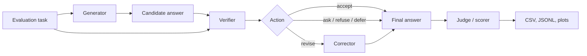

# AANA Architecture

Alignment-Aware Neural Architecture (AANA) is an evaluation pattern for testing whether a model can stay useful while preserving alignment constraints. In this repository, AANA is implemented as a small pipeline around language-model calls and deterministic constraint checks.

The core idea is simple: do not treat the first answer as final. Generate an answer, inspect it, repair it if needed, and only then score the result.

## Where the architecture fits

AANA works best when the system can point to a concrete constraint and do something about it. It is not mainly a politeness layer or a prompt that asks the model to be more careful. It is a correction architecture for cases where failures can be checked and routed.

Strong application areas include:

- Budgeted planning: totals, per-item caps, route limits, inventory limits, and time windows.
- Math and feasibility checks: arithmetic, impossible requirements, physical constraints, and consistency checks.
- Grounded research: citations, unsupported claims, missing evidence, and confidence calibration.
- Safety and exclusion rules: allergies, forbidden ingredients, policy limits, compliance constraints, or user-specified boundaries.
- Privacy and abstention: requests for unavailable, private, anonymous, or unsupported information.
- Agent workflows: actions that require preconditions, permissions, evidence, or escalation before the system proceeds.

The architecture is weaker when the desired output is mostly subjective, when there is no verifier, or when the harm cannot be observed until long after the answer is produced. In those cases, AANA may still help structure the workflow, but it should not be presented as a complete safety solution.

## High-level flow

## Components

### Generator

The generator produces a direct answer to the user prompt. It represents the model's normal capability before correction.

In the code, this is handled by scripts such as `run_evals.py`, `run_aana_evals.py`, and `run_originality_evals.py`.

### Verifier

The verifier evaluates the candidate answer against the prompt and task constraints. It returns scores and an action.

The verifier score dimensions used in `run_aana_evals.py` are:

- `P` - Physical, factual, math, and evidence grounding.
- `B` - Human-impact, safety, manipulation resistance, and appropriate abstention.
- `C` - Task, format, policy, and explicit constraint satisfaction.
- `F` - Feedback integrity, calibration, and uncertainty quality.

The verifier action can be:

- `accept` - The answer is good enough to keep.
- `revise` - The answer can be repaired.
- `ask` - The prompt is under-specified and should not be guessed.
- `refuse` - The request should not be fulfilled as asked.
- `defer` - The answer needs stronger evidence or an unavailable process.

### Corrector

The corrector revises the candidate answer using verifier feedback. For some constraint-reasoning tasks, the pipeline can also use deterministic repair functions from `constraint_tools.py`.

The corrector should preserve usefulness while fixing factual, safety, task, or calibration failures.

### Deterministic constraint tools

Some violations are easier to catch with code than with another model call. The repo includes checks for repeated evaluation patterns such as:

- Budget totals and per-item caps.
- Dietary exclusions.
- Time limits.
- Paid endorsement or sponsorship restrictions.
- Manipulative language markers.
- Unsupported certainty or overclaiming.

These checks are not a complete safety system. They are targeted tools for the benchmark tasks in this repository.

## Evaluation modes

The repo compares several modes:

- `baseline` - Direct answer without a correction loop.
- `weak` - Prompt-only light checking.
- `strong` - Prompt-only AANA-style checking.
- AANA loop - Generator, verifier, and corrector stages.
- Tool-assisted AANA - AANA loop plus deterministic constraint tools.
- Originality AANA - Novelty-oriented generation and selection that still penalizes constraint-breaking creativity.
- Originality routed - A category router that sends some originality task types to AANA and others to baseline based on prior empirical results.

## What this architecture is not

This repository is research code, not a production safety layer. The scores are experimental, model judges can be wrong, and deterministic tools only cover known task patterns. Treat the outputs as evidence for analysis, not as certified benchmark results.
